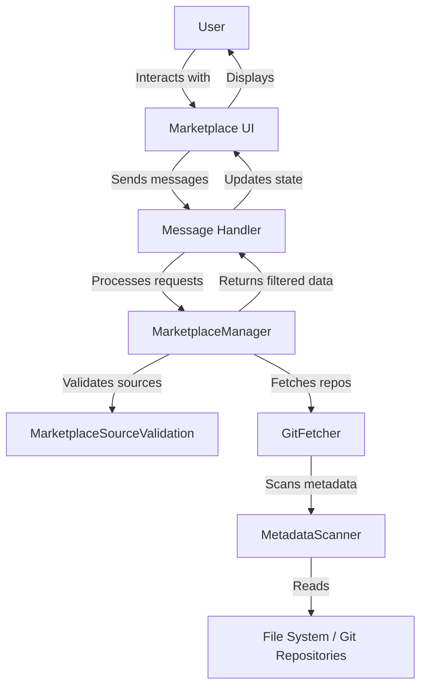
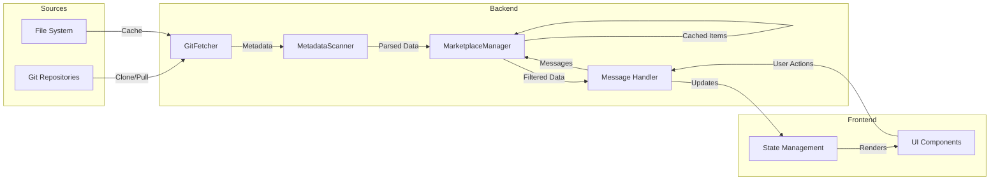
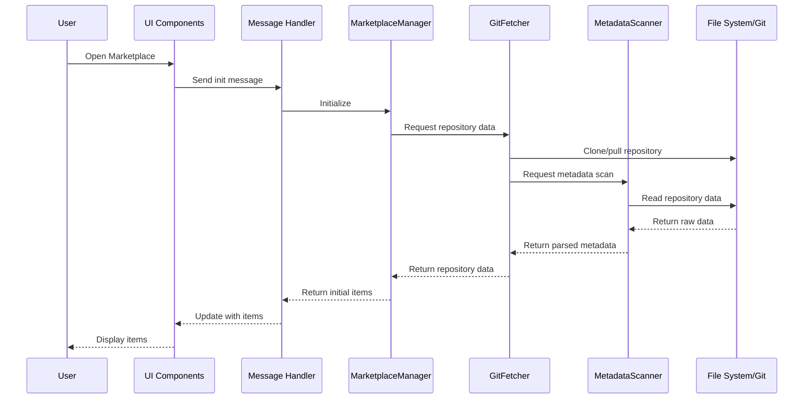
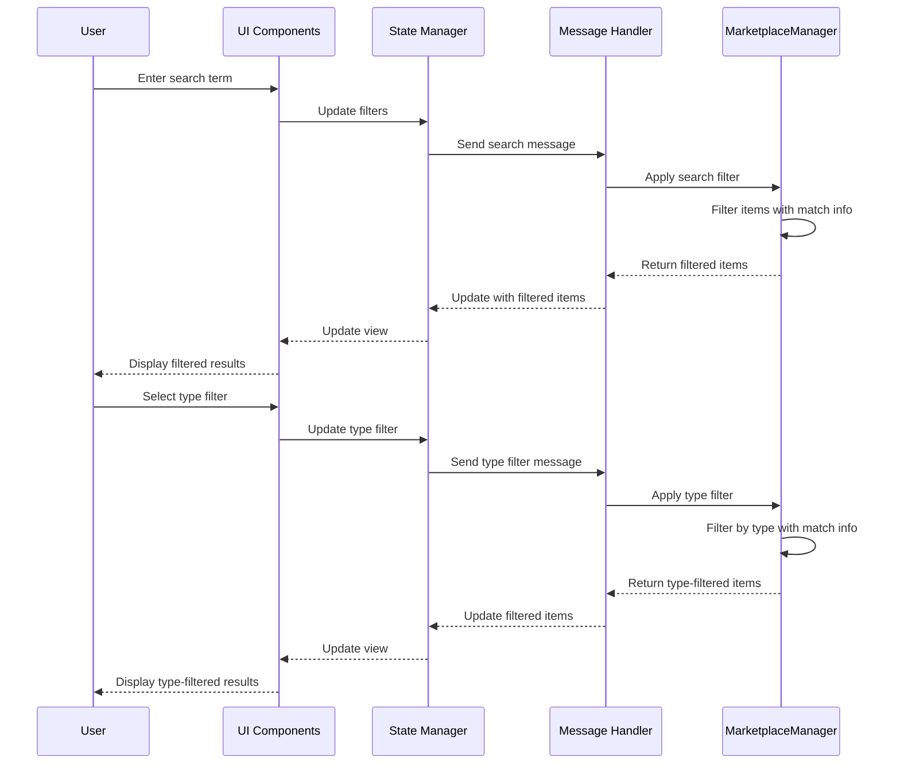
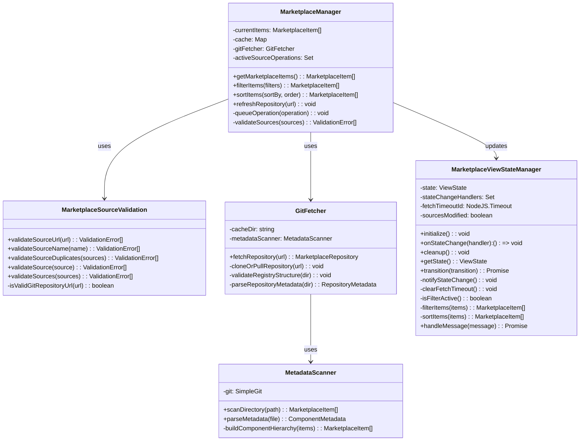

# Marketplace Architecture

This document provides a comprehensive overview of the Marketplace's architecture, including its components, interactions, and data flow.

## System Overview

The Marketplace is built on a modular architecture that separates concerns between data management, UI rendering, and user interactions. The system consists of several key components that work together to provide a seamless experience for discovering, browsing, and managing items.

### High-Level Architecture

The architecture follows a message-based pattern where:

1. The UI sends messages to the backend through a message handler
2. The backend processes these messages and returns results
3. The UI updates based on the returned data
4. Components are loosely coupled through message passing

## Component Interactions

The Marketplace components interact through a well-defined message flow:

### Core Interaction Patterns

1. **Data Loading**:

    - GitFetcher handles repository cloning and updates
    - MetadataScanner loads item data from repositories
    - MarketplaceManager manages caching and concurrency
    - UI requests data through the message handler

2. **Filtering and Search**:

    - UI sends filter/search criteria to the backend
    - MarketplaceManager applies filters with match info
    - Filtered results are returned to the UI
    - State manager handles view-level filtering

3. **Source Management**:
    - UI sends source management commands
    - MarketplaceManager coordinates with GitFetcher
    - Cache is managed with timeout protection
    - Sources are processed with concurrency control

## Data Flow Diagram

The following diagram illustrates the data flow through the Marketplace system:

## Sequence Diagrams

### Item Loading Sequence

The following sequence diagram shows how items are loaded from sources:

### Search and Filter Sequence

This sequence diagram illustrates the search and filter process:

## Class Diagrams

### Core Classes

The following class diagram shows the main classes in the Marketplace system:

## Component Responsibilities

### Backend Components

1. **GitFetcher**

    - Handles Git repository operations
    - Manages repository caching
    - Validates repository structure
    - Coordinates with MetadataScanner

2. **MetadataScanner**

    - Scans directories and repositories
    - Parses YAML metadata files
    - Builds component hierarchies
    - Handles file system operations

3. **MarketplaceManager**

    - Manages concurrent operations
    - Handles caching with timeout protection
    - Coordinates repository operations
    - Provides filtering and sorting

4. **marketplaceMessageHandler**
    - Routes messages between UI and backend
    - Processes commands from the UI
    - Returns data and status updates
    - Handles error conditions

### Frontend Components

1. **MarketplaceViewStateManager**

    - Manages frontend state and backend synchronization
    - Handles state transitions and message processing
    - Manages filtering, sorting, and view preferences
    - Coordinates with backend state
    - Handles timeout protection for operations
    - Manages source modification tracking
    - Provides state change subscriptions

2. **MarketplaceSourceValidation**

    - Validates Git repository URLs for any domain
    - Validates source names and configurations
    - Detects duplicate sources (case-insensitive)
    - Provides structured validation errors
    - Supports multiple Git protocols (HTTPS, SSH, Git)

3. **MarketplaceItemCard**

    - Displays item information
    - Handles tag interactions
    - Manages expandable sections
    - Shows match highlights
    - Handle item actions.

4. **ExpandableSection**

    - Provides collapsible sections
    - Manages expand/collapse state
    - Handles animations
    - Shows section metadata

5. **TypeGroup**
    - Groups items by type
    - Formats item lists
    - Highlights search matches
    - Maintains consistent styling

## Performance Considerations

The Marketplace architecture addresses several performance challenges:

1. **Concurrency Control**:

    - Source operations are locked to prevent conflicts
    - Operations are queued during metadata scanning
    - Cache timeouts prevent hanging operations
    - Repository operations are atomic

2. **Efficient Caching**:

    - Repository data is cached with expiry
    - Cache is cleaned up automatically
    - Forced refresh available when needed
    - Cache directories managed efficiently

3. **Smart Filtering**:
    - Match info tracks filter matches
    - Filtering happens at multiple levels
    - View state optimizes re-renders
    - Search is case-insensitive and normalized

## Error Handling

The architecture includes robust error handling:

1. **Repository Operations**:

    - Git lock files are cleaned up
    - Failed clones are retried
    - Corrupt repositories are re-cloned
    - Network timeouts are handled

2. **Data Processing**:

    - Invalid metadata is gracefully handled
    - Missing files are reported clearly
    - Parse errors preserve partial data
    - Type validation ensures consistency

3. **State Management**:
    - Invalid filters are normalized
    - Sort operations handle missing data
    - View updates are atomic
    - Error states are preserved

## Extensibility Points

The Marketplace architecture is designed for extensibility:

1. **Repository Sources**:

    - Support for multiple Git providers
    - Custom repository validation
    - Flexible metadata formats
    - Localization support

2. **Filtering System**:

    - Custom filter types
    - Extensible match info
    - Flexible sort options
    - View state customization

3. **UI Components**:
    - Custom item renderers
    - Flexible layout system
    - Theme integration
    - Accessibility support

---

**Previous**: [Adding Custom Item Sources](../user-guide/06-adding-custom-sources.md) | **Next**: [Core Components](./02-core-components.md)
